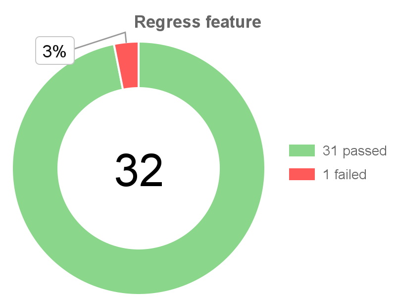
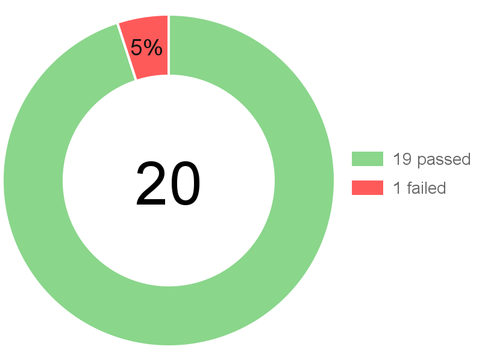
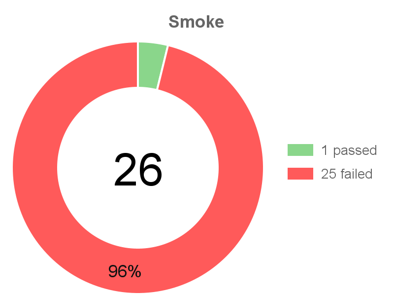
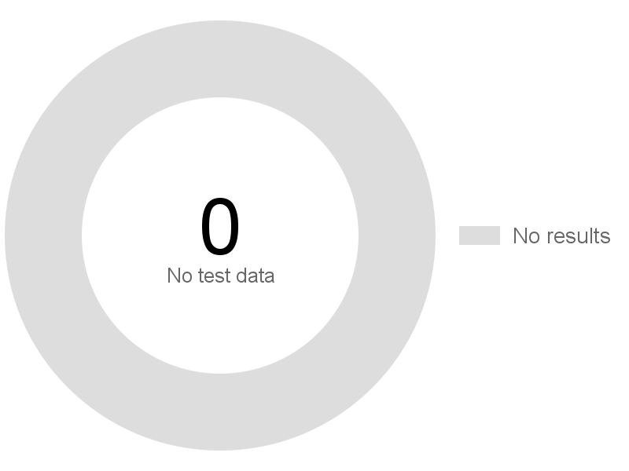

# Chart Renderer

Small local Java2D renderer for Jenkins notifications. It creates a PNG doughnut chart without external dependencies, Node.js, native canvas libraries, or a long-running HTTP service.

Requirements:

- Java 17 or newer.
- Maven is optional. The lightweight scripts build the production JAR with the JDK tools only.

## Build

Lightweight Linux/Jenkins build:

```bash
bash ./java/chart-renderer/build.sh
```

Lightweight Windows build:

```powershell
.\java\chart-renderer\build.ps1
```

The jar is written to:

```text
java/chart-renderer/build/libs/chart-renderer.jar
```

Maven build with the full test suite:

```bash
cd java/chart-renderer
mvn clean package
```

The Maven JAR is written to `java/chart-renderer/target/chart-renderer.jar`.

## Run

```bash
java -Xms16m -Xmx64m -Djava.awt.headless=true \
  -jar java/chart-renderer/build/libs/chart-renderer.jar \
  --passed 19 \
  --failed 1 \
  --width 400 \
  --height 300 \
  --scale 2 \
  --output chart-output/chart.png
```

`--width` and `--height` are logical dimensions. The default `--scale 2` creates a high-DPI `800x600` PNG for crisp rendering in Teams/email at a displayed size of about `400x300`.

Optional title:

```bash
java -Xms16m -Xmx64m -Djava.awt.headless=true \
  -jar java/chart-renderer/build/libs/chart-renderer.jar \
  --passed 120 \
  --failed 7 \
  --title "Test target checkout" \
  --output chart-output/chart.png
```

PowerShell run example:

```powershell
java -Xms16m -Xmx64m "-Djava.awt.headless=true" `
  -jar .\java\chart-renderer\build\libs\chart-renderer.jar `
  --passed 19 `
  --failed 1 `
  --output chart-output\chart.png
```

## Examples

These previews are generated by the Java renderer with `--width 400 --height 300 --scale 2`.

| Case | Arguments | Render |
| --- | --- | --- |
| Small failed segment | `--passed 31 --failed 1` |  |
| Regular failed segment | `--passed 19 --failed 1` |  |
| Mostly failed smoke | `--passed 1 --failed 25 --title "Smoke"` |  |
| No test data | `--passed 0 --failed 0` |  |

## Jenkins Usage

Run the renderer after test result counters are known, then upload `chart.png` to the existing image host:

```bash
java -Xms16m -Xmx64m -Djava.awt.headless=true \
  -jar notifications/chart-renderer.jar \
  --passed "${PASSED}" \
  --failed "${FAILED}" \
  --output chart-output/chart.png
```

When both counters are zero, the renderer writes a neutral placeholder chart instead of failing. This keeps Teams/email notifications renderable even when a run produced no test results.

On constrained image sizes, four-digit counters automatically use a compact numeric legend when dropping `passed` and `failed` meaningfully increases the chart size. Short counters and wider images keep the full labels.

The renderer exits with a non-zero code when counters are invalid or the output cannot be written.

The CLI rejects unknown or duplicate options, non-finite numeric values, test totals above `100000`, and output dimensions above the renderer's four-million-pixel memory guard.

## Architecture

The runtime remains dependency-free and follows a functional-core/imperative-shell structure:

- `cli` parses and validates the command line.
- `model` contains immutable render options and test counters.
- `render` calculates layout and renders a `BufferedImage`.
- `io` writes the rendered image as PNG.
- `app` coordinates the use case and maps failures to CLI exit codes.

`ChartRenderer` is intentionally kept as a minimal executable entry point for backward-compatible `java -jar` usage.

## Tests

Full unit and integration suite:

```bash
cd java/chart-renderer
mvn test
```

The JUnit suite covers argument parsing, validation, memory limits, percentage-label placement, representative image rendering, PNG output, and application exit codes.

Dependency-free executable JAR smoke tests:

Linux/Jenkins:

```bash
bash ./java/chart-renderer/test.sh
```

Windows:

```powershell
.\java\chart-renderer\test.ps1
```

The smoke scripts build the JAR, execute it for representative edge cases, and verify that each output is a readable PNG with the expected pixel dimensions.

## GitHub Actions

`Java CI` runs the Maven test suite and production JAR smoke tests for Java renderer pull requests and pushes to `main`. The exact production JAR from `build/libs` is uploaded as a workflow artifact for seven days.

Pushing a version tag publishes the tested JAR and its SHA-256 checksum as a GitHub Release:

```bash
git tag v1.0
git push origin v1.0
```

Jenkins can download a pinned release instead of rebuilding the renderer:

```bash
curl -fsSL \
  -o chart-renderer.jar \
  https://github.com/Ciscoadmin/ta-chart/releases/download/v1.0/chart-renderer.jar
```
